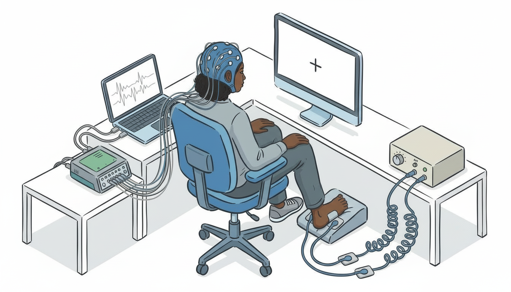

# EEG-Based Detection of Somatosensory Perceptual Thresholds

EEG + machine learning for objective detection of perceptual thresholds during transcutaneous electrical stimulation. Toward automated calibration of somatosensory neuroprostheses.



---

## Motivation

Calibrating somatosensory neuroprostheses currently requires lengthy psychophysical procedures where participants verbally report whether they perceive stimulation. This process is:
- Time-consuming
- Subjective and prone to response bias
- Fatiguing for participants

An objective, EEG-based method could detect the perceptual threshold by identifying the presence or absence of somatosensory evoked potentials (SEPs), enabling faster calibration and real-time adaptation of stimulation parameters.

---

## Approach

1. Deliver transcutaneous electrical stimulation at varying amplitudes (subthreshold → suprathreshold)
2. Record EEG time-locked to stimulation
3. Extract features using Common Spatial Patterns (CSP)
4. Classify epochs as threshold vs subthreshold using Linear Discriminant Analysis (LDA)
5. Validate with cross-validation and permutation testing

---

## Experimental Setup

### Equipment
| Component | Model |
|-----------|-------|
| EEG Amplifier | g.USBamp (g.tec) |
| Electrode Driver | g.GAMMAbox |
| Stimulator | DS8R (Digitimer) |
| Stimulation Electrodes | Transcutaneous, foot |

### Stimulation Protocol
| Parameter | Value |
|-----------|-------|
| Pulse width | 200 µs |
| Inter-pulse interval | 680 ms |
| Amplitudes | 7 levelsaround threshold (subthreshold → suprathreshold) |
| Trials per amplitude | 5 (baseline); 30–50 (planned) |
| Threshold determination | 2AFC psychophysics task (79% criterion) |

### EEG Montage

16-channel montage optimized for tibial somatosensory evoked potentials:


---

## Analysis Pipeline

```
Raw EEG
    │
    ▼
Preprocessing
    ├── Bandpass filter (0.5–50 Hz)
    ├── Common average reference
    └── ICA artifact rejection
    │
    ▼
Epoch extraction (-100 to 500 ms)
    │
    ▼
Feature extraction (CSP)
    │
    ▼
Classification (LDA)
    │
    ▼
Validation
    ├── Stratified k-fold CV
    └── Permutation test
```

---

## Results

See [results/01_baseline_results.md](results/01_baseline_results.md) for baseline analysis.


---

## License

MIT
