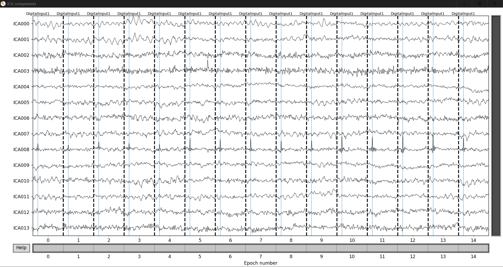
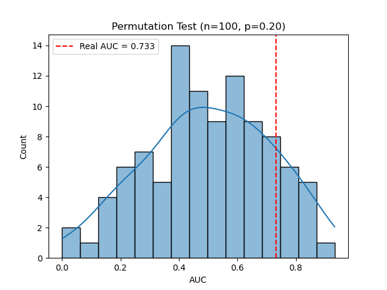
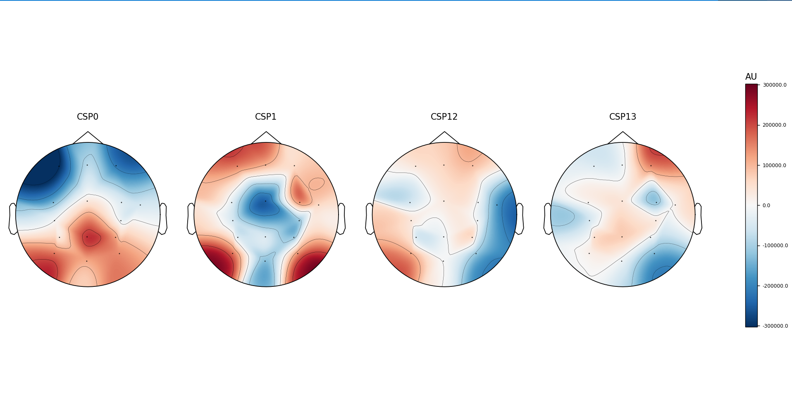

# Baseline Results:

## Dataset

| Parameter | Value |
|-----------|-------|
| Subject | 1 |
| Amplitudes (mA) | 1.71, 2.28, 2.85, **3.42 (threshold)**, 3.99, 4.56, 5.13 |
| Trials per amplitude | 5 |
| Total trials | 35 |
| Inter-pulse interval | 680 ms |
| Pulse width | 200 µs |
| Channels | 16 (T7 dropped as bad) |
| Sampling rate | 256 Hz |
| EEG system | g.USBamp + g.GAMMAbox |

Raw EEG data not included in repository.

## Preprocessing

1. **Filtering:** Bandpass 0.5–50 Hz
2. **Reference:** Common average reference (CAR)
3. **Artifact rejection:** ICA (1 component excluded)
4. **Baseline correction:** None
5. **Epoch window:** -100 to 500 ms relative to stimulus

---

## Classification: Threshold vs Subthreshold

### Method
- **Features:** Common Spatial Patterns (CSP), 4 components
- **Classifier:** Linear Discriminant Analysis (LDA) with shrinkage
- **Validation:** 5-fold Stratified Cross-Validation
- **Metric:** Area Under ROC Curve (AUC)
- **Statistical test:** Permutation test (n=100)

### Class Distribution
| Class | Amplitudes (mA) | Trials |
|-------|-----------------|--------|
| Threshold | 3.42 | 5 |
| Subthreshold | 1.71, 2.28, 2.85 | 15 |

### Results

| Metric | Value |
|--------|-------|
| AUC | 0.733 |
| p-value | 0.20 |
| Significant (α=0.05)? | No |

### Permutation Test

*Figure 1: Distribution of AUC scores from 100 permutations with shuffled labels. Red dashed line indicates observed AUC (0.733). p=0.20 indicates result is not statistically significant.*

---

## CSP Spatial Patterns

*Figure 2: Spatial patterns for CSP components 0, 1, 12, and 13. No clear vertex (Cz/CPz) focus observed. Patterns are distributed across frontal-parietal regions, inconsistent with expected tibial SEP topography (P37 at vertex).*

---

## Limitations

1. **Insufficient trials:** Only 5 trials per amplitude; minimum 30–50 recommended
2. **Missing CPz:** Most critical electrode for tibial SEP not recorded
3. **Short pulse width:** 200 µs may be insufficient for robust SEP generation
4. **Class imbalance:** 5 threshold vs 15 subthreshold trials
5. **No clear SEP in averaged ERPs:** Signal may be too weak or variable

---

## Conclusion

Current data does not demonstrate statistically significant discrimination between threshold and subthreshold epochs (AUC=0.733, p=0.20). CSP patterns do not localize to expected somatosensory generators. Results are inconclusive due to insufficient trials and suboptimal electrode montage.

---

